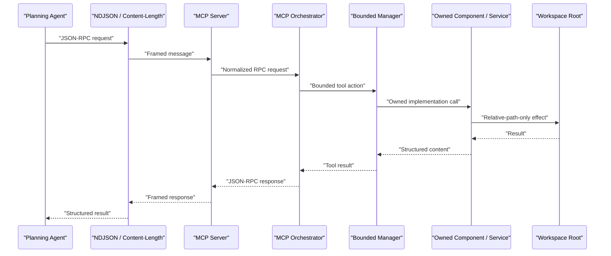

# UsefulHELPER

UsefulHELPER is a root-bounded MCP-style worker designed to act as low-token mechanical hands for a higher-level planning agent.

It is built for repeatable, structured execution work:

- scaffold folders and boilerplate files
- read and patch files through structured JSON inputs
- search text with bounded regex scans
- scan Python projects with `ast`
- inspect and safely extract bounded `.zip` archives
- ingest projects into a SQLite-backed sandbox `HEAD`
- stage diffs and export sandbox state back to folders
- build and search a SQLite-backed reusable parts catalog
- run bounded Python verification helpers
- maintain a tasklist and append-only journal
- export itself as a vendored sidecar into another app
- call local Ollama models through explicit bounded tools and a swappable inference loop slot
- expose a lightweight Tkinter operator monitor over runtime events and logs

The project is intentionally biased toward deterministic tools first, then bounded inference tools, rather than open-ended autonomous behavior.

## Documentation Set

UsefulHELPER now carries both canonical and mirror documentation surfaces so a vendored sidecar can still be onboarded and operated cleanly.

Primary docs:

- `_docs/builder_constraint_contract.md`
- `_docs/ARCHITECTURE.md`
- `_docs/TOOLS.md`
- `_docs/TESTING.md`
- `_docs/WORKER_MICRO_CONTRACT.md`
- `_docs/ONBOARDING.md`
- `_docs/TODO.md`
- `_docs/dev_log.md`

Canonical continuity surfaces:

- `_docs/_AppJOURNAL/README.md`
- `_docs/_AppJOURNAL/BACKLOG.md`
- `_docs/_AppJOURNAL/CURRENT_TASKLIST.md`
- `_docs/_journalDB/app_journal.sqlite3`

## What This Project Is

UsefulHELPER is not meant to replace the planning agent.

The intended split is:

- the planning agent decides what should happen
- UsefulHELPER performs bounded, structured work
- the planning agent reviews the result, adjusts, and asks for the next step

This keeps token costs lower, makes repeated workflows more reliable, and preserves strong guardrails around filesystem effects.

## Design Goals

- deterministic tool execution before autonomous behavior
- strong filesystem boundaries
- clear ownership across orchestrator, manager, component, and service layers
- vendorable, app-local sidecar deployment
- builder-memory continuity through tasklists and journal entries
- local-model use only through explicit tools and swappable loop cartridges

## When To Use UsefulHELPER

UsefulHELPER is a good fit when you want:

- repeatable filesystem operations with clear boundaries
- a helper that can scaffold its own next tool
- a vendorable sidecar you can bundle with each app
- a way to reduce planning-agent token spend on mechanics
- bounded local-model inference with structured output
- a normalized internal workbench for lower-friction project reasoning

UsefulHELPER is not yet the right tool for:

- unrestricted shell or system administration
- multi-root write orchestration in one session
- uncontrolled autonomous planning loops
- automatic hot-reload of arbitrary newly generated code

UsefulHELPER is now also a good fit when you want:

- a cheaper internal project mirror than repeated full-tree rereads
- revision-aware staging before exporting changes to a folder
- Python symbol queries over the current sandbox `HEAD`

## Core Safety Model

UsefulHELPER has three important roots:

- `source_root`
  - where the worker's own source code lives
- `project_root`
  - where the running worker stores its runtime state, logs, and builder-memory surfaces
- `workspace_root`
  - the only root the normal workspace tools are allowed to read from or write to

The key guardrails are:

- one explicit `workspace_root` per process session
- tool paths must be relative to that workspace root
- absolute tool paths are rejected
- no raw shell tool is exposed in the current tranche
- tasklist and journal memory stay under the worker project's `_docs/` surfaces
- sandbox state lives under the worker project's `data/sandbox/` surface
- parts catalog state lives under the worker project's `data/parts/` surface
- sidecar export may read from `source_root`, but it still writes only under `workspace_root`

The reduced worker doctrine is recorded in `_docs/WORKER_MICRO_CONTRACT.md`.

## Root Model In Practice

These three roots are easy to blur if they are not stated concretely.

Typical source-worker session:

- `source_root`
  - `C:\...\UsefulHELPER`
- `project_root`
  - `C:\...\UsefulHELPER`
- `workspace_root`
  - `C:\...\SomeTargetApp`

Typical vendored-sidecar session:

- `source_root`
  - `C:\...\SomeTargetApp\_sidecar\usefulhelper`
- `project_root`
  - `C:\...\SomeTargetApp\_sidecar\usefulhelper`
- `workspace_root`
  - `C:\...\SomeTargetApp`

That separation matters because:

- runtime databases and logs belong under `project_root`
- sandbox databases and revision history belong under `project_root`
- parts catalog databases belong under `project_root`
- normal file tools operate only under `workspace_root`
- sidecar export reads from `source_root` but never grants broader write authority

## Current Capabilities

- `capabilities.describe`
  - reports worker metadata, tool names, and guardrail status

- `fs.list_tree`
  - lists files and directories under a workspace-relative path

- `archive.inspect_zip`
  - inspects bounded `.zip` archives and reports unsafe paths before extraction

- `archive.extract_zip`
  - extracts bounded `.zip` archives with zip-slip protection

- `fs.make_tree`
  - creates directories under the workspace root

- `fs.read_files`
  - reads UTF-8 files under the workspace root

- `fs.write_files`
  - writes UTF-8 files from structured JSON payloads

- `fs.patch_text`
  - applies simple structured text edits to existing files

- `fs.search_text`
  - searches UTF-8 files under the workspace root with regex support

- `project.scaffold_from_manifest`
  - creates a folder tree and boilerplate files from a manifest

- `worker.create_tool_scaffold`
  - scaffolds a new worker-tool stub, test, and blueprint

- `worker.refresh_extension_tools`
  - validates blueprint manifests and hot-loads extension tools without a full restart

- `sidecar.export_bundle`
  - previews or installs a lean UsefulHELPER sidecar into a target app folder with guarded reinstall support

- `ast.scan_python`
  - parses Python source with the standard-library `ast` module and returns structural summaries

- `sandbox.init`
  - initializes or resets the SQLite-backed project sandbox

- `sandbox.ingest_workspace`
  - ingests bounded workspace files into sandbox `HEAD` and immutable revision history

- `sandbox.read_head`
  - reads files from sandbox `HEAD`

- `sandbox.search_head`
  - searches sandbox `HEAD` contents with regex support

- `sandbox.stage_diff`
  - stages structured edits against sandbox `HEAD` without touching the live workspace tree

- `sandbox.export_head`
  - materializes sandbox `HEAD` back into a bounded workspace folder

- `sandbox.history_for_file`
  - returns current `HEAD` metadata and recent revision history for one file

- `sandbox.query_symbols`
  - returns Python import/class/function symbols from current sandbox `HEAD`

- `parts.catalog_build`
  - builds or rebuilds a SQLite-backed reusable parts catalog from bounded source trees

- `parts.catalog_search`
  - searches the local parts catalog with SQLite FTS-backed and token-aware ranked matching
  - returns an evidence shelf with a shelf summary, location index, and per-item summaries

- `parts.catalog_get`
  - reads cataloged parts with metadata, content, and symbols

- `parts.export_selection`
  - exports selected catalog parts back into a bounded workspace folder

- `python.run_unittest`
  - runs allowlisted unittest discovery inside the workspace root

- `python.run_compileall`
  - runs allowlisted compileall checks inside the workspace root

- `inference.describe_loops`
  - reports the registered inference loop cartridges and the active default loop slot

- `ollama.chat_json`
  - runs the active or requested inference loop cartridge and returns a parsed JSON object

- `ollama.chat_text`
  - runs the active or requested inference loop cartridge and returns text

- `ollama.list_models`
  - lists currently available local Ollama models

- `journal.append`
  - appends a meaningful work-phase entry to the app journal

- `tasklist.replace`
  - replaces the current bounded tasklist

- `tasklist.view`
  - reads the current tasklist

- `run_monitor.bat` or `python -m src.app --ui monitor`
  - opens a lightweight operator monitor over the runtime event ledger and app log
  - groups recent activity into request, workspace, execution, inference, memory, and other lanes
  - shows selected-event payload/response detail plus app-log tail
  - includes right-click helper actions for `Summarize`, `Ask About`, and `Settings`

## Quick Start

### 1. Create the environment

```bat
setup_env.bat
```

### 2. Run the worker directly

```bat
run.bat --transport content-length
```

You can also use:

- `--transport ndjson`
- `--transport auto`
- `--project-root <path>`
- `--workspace-root <path>`

If `--workspace-root` is omitted, the worker uses the `project_root` as the workspace root for that session.

### 3. Launch the operator monitor

```bat
run_monitor.bat
```

You can also use:

```bat
python -m src.app --ui monitor
```

The monitor is a separate operator view over the worker project's runtime DB and app log. It is meant to run alongside the worker, not replace the MCP serve loop.

## Runtime Flow



## Transport Modes

UsefulHELPER supports:

- `Content-Length` framing
- `NDJSON` framing

Internally both are normalized into the same JSON-RPC request path.

### NDJSON example

```json
{"jsonrpc":"2.0","id":1,"method":"initialize","params":{}}
{"jsonrpc":"2.0","id":2,"method":"tools/list","params":{}}
```

### Content-Length example

```text
Content-Length: 58

{"jsonrpc":"2.0","id":1,"method":"initialize","params":{}}
```

## JSON-RPC Shape

UsefulHELPER currently handles these RPC methods:

- `initialize`
- `ping`
- `tools/list`
- `tools/call`

### Example `tools/call`

```json
{
  "jsonrpc": "2.0",
  "id": 3,
  "method": "tools/call",
  "params": {
    "name": "fs.write_files",
    "arguments": {
      "files": [
        {
          "path": "notes/example.txt",
          "content": "hello from UsefulHELPER\n"
        }
      ],
      "mode": "overwrite"
    }
  }
}
```

## Operator Recipes

### Filesystem work

UsefulHELPER is intentionally tool-first, not shell-first.

Normal file work should happen through:

- `fs.make_tree`
- `fs.read_files`
- `fs.write_files`
- `fs.patch_text`
- `fs.search_text`

That means:

- no `echo` hacks for file creation
- no ad hoc shell edits as the default path
- structured inputs
- structured outputs

### Archive intake

Use:

- `archive.inspect_zip`
- `archive.extract_zip`
- `intake.zip_to_sandbox`

when you need to study vendored bundles or intake packages safely inside the declared workspace root.

Recommended flow:

1. for a manual lane, inspect first, extract second, then ingest the extracted tree into sandbox `HEAD`
2. for the default fast lane, call `intake.zip_to_sandbox`
3. search or query symbols from the sandbox

The one-call intake response now also includes:

- `bundle_summary`
  - top-level items
  - top-level Python files
  - detected summary files
  - parsed manifest details when available
- `likely_entrypoints`
  - likely MCP, app, backend, UI, and self-test entry files inferred from manifests and common file names

### Project scaffolding

Use `project.scaffold_from_manifest` when you already know the folders and files you want.

Use `worker.create_tool_scaffold` when UsefulHELPER itself needs the next tool stub, test stub, and blueprint to be created inside its own codebase.

Use `worker.refresh_extension_tools` after implementing or updating an extension component under `src/core/components/extensions/` when you want the worker to pick it up without a restart.

### Sandbox workbench

UsefulHELPER now has a typed internal sandbox for project reasoning.

Recommended flow:

1. `sandbox.init`
2. either `sandbox.ingest_workspace` for plain folders or `intake.zip_to_sandbox` for bundle intake
4. `sandbox.read_head`, `sandbox.search_head`, or `sandbox.query_symbols`
5. `sandbox.stage_diff`
6. `sandbox.export_head`
7. `python.run_unittest` or `python.run_compileall`

That keeps the live workspace as the execution surface while letting the worker reason over a normalized `HEAD` plus revision history.

### Parts shelf

UsefulHELPER now has a local reusable parts shelf backed by SQLite.

Recommended flow:

1. `parts.catalog_build`
2. `parts.catalog_search`
3. `parts.catalog_get`
4. `parts.export_selection`

The search path is SQLite FTS-backed and token-aware, so queries like `sidecar export bundle` can still surface the right component even when that exact phrase does not appear contiguously in one file.

`parts.catalog_search` also supports retrieval steering:

- `intent_target`
  - `auto`, `structural`, `verbatim`, `semantic`, or `relational`
- `prefer_code`
  - nudges the shelf toward implementation files
- `prefer_docs`
  - nudges the shelf toward operator-facing documents

In practice this lets the same semantic query produce different evidence shelves:

- `prefer_code` plus `intent_target=structural` favors components, managers, orchestrators, and services
- `prefer_docs` favors canonical docs like `README.md`, `_docs/ARCHITECTURE.md`, and `_docs/TOOLS.md`
- history-flavored queries like `journal history ...` can pivot the shelf toward `_docs/dev_log.md` and journal evidence

The response is also shaped as an evidence shelf:

- `shelf_summary`
- `location_index`
- `location_records`
- `items`

Each shelf item includes:

- stable `location`
- `document_role`
- `item_summary`
- `why_matched`
- ranking evidence like `score`, `matched_token_count`, and `fts_rank`

### Python analysis

Use `ast.scan_python` to get a low-cost structural view of a Python codebase before deciding on edits.

Use `fs.search_text` when you need fast bounded content search before reading or patching files.

### Bounded verification helpers

Use:

- `python.run_unittest`
- `python.run_compileall`

when you want UsefulHELPER to execute the most common Python verification steps without exposing a broad shell surface.

### Allowlisted sysops wrappers

Use:

- `sysops.git_status`
- `sysops.git_diff_summary`
- `sysops.git_repo_summary`
- `sysops.git_recent_commits`

when you need read-only Git awareness through a bounded tool instead of ad hoc shell commands.

Current wrapper rules:

- Git only
- read-only
- workspace-root bounded
- graceful non-repo reporting
- no arbitrary command execution

### Builder memory

Use:

- `tasklist.replace`
- `tasklist.view`
- `journal.append`

to preserve continuity across interrupted sessions and meaningful phases.

### Operator monitor

Use `run_monitor.bat` or `python -m src.app --ui monitor` when you want a quick human-facing window over the worker's recent activity.

The current monitor shows:

- a small recent-activity registry by lane
- grouped tabs for `requests`, `workspace`, `execution`, `inference`, `memory`, and `other`
- selected-event payload and response details
- app-log tail
- right-click helper actions on the main panels

The helper actions are:

- `Summarize`
  - summarizes the current panel contents or selected text
- `Ask About`
  - locks the current panel contents or selected text, then lets you ask a follow-up question
- `Settings`
  - lets you assign a model and editable instructions to each helper action
  - now loads model choices from local Ollama through a refreshable dropdown instead of free-text typing

Recent monitor-helper polish:

- helper and settings modals open near the mouse position
- opening a new helper/settings modal closes the previous one
- the ask/close footer stays visible without manual resizing
- empty model replies now fall back to a context-aware operator answer instead of an empty result
- the helper now builds structured monitor-context packets before inference so the model sees parsed fields, derived facts, and a focused context excerpt instead of only raw panel text
- simple log-listing and event-explanation questions are answered mechanically first when possible, which reduces drift and keeps smaller models useful
- `Ask About` now keeps a small sliding conversation window with summarized falloff so follow-up questions can build on prior answers without ballooning context
- if a model mostly repeats the prompt back, the helper now replaces that echo with a clearer suggestion to try a larger model

The inference tab is currently the easiest place to inspect prompt, model, and structured-response history through the event ledger.

## Local Ollama Integration

UsefulHELPER exposes bounded Ollama tools:

- `inference.describe_loops`
- `ollama.chat_json`
- `ollama.chat_text`
- `ollama.list_models`

The tool is intentionally narrow:

- local Ollama only
- JSON object output only
- explicit prompt payloads only
- no autonomous tool loop hidden inside the worker
- inference remains separate from workspace file authority

### Example `ollama.chat_json`

```json
{
  "jsonrpc": "2.0",
  "id": 4,
  "method": "tools/call",
  "params": {
    "name": "ollama.chat_json",
    "arguments": {
      "model": "qwen2.5:0.5b",
      "system": "Return JSON only.",
      "user": "Return {\"status\":\"ok\",\"value\":7}.",
      "temperature": 0,
      "max_tokens": 80,
      "timeout_seconds": 60
    }
  }
}
```

Expected result shape:

- `loop_name`
- `provider`
- `model`
- `parsed_json`
- `raw_content`
- `done`
- token/eval metadata when available

`ollama.chat_text` uses the same loop slot but returns `content` instead of `parsed_json`.

Use `inference.describe_loops` when the planner needs to confirm the active default cartridge. Use `ollama.list_models` first when the planner needs to choose between local `0.5b`, `4b`, `7b`, or `9b` options at runtime.

## Model Selection Guidance

The worker should generally prefer the smallest model that can do the job reliably.

Suggested policy:

| Job type | Recommended size | Example use |
|---|---:|---|
| Tiny schema fill or routing hint | `0.5b` to `1.5b` | simple JSON extraction, tiny classification |
| Short structured planning helper | `3b` to `4b` | compact next-step JSON, basic rewrite plans |
| Harder code/task reasoning | `7b` | richer structured breakdowns, tougher prompt-to-JSON synthesis |
| Heavier local reasoning | `9b` | more complex structured guidance when smaller models drift |

Practical guidance:

- start at `0.5b` or `1.5b` for simple JSON-only helpers
- move to `4b` when schema adherence or reasoning quality is weak
- use `7b` or `9b` for heavier structured reasoning only when the smaller models are not holding up
- do not let local inference become a substitute for deterministic tools

## Vendoring As A Sidecar

UsefulHELPER is designed to be vendored into apps instead of being treated as a shared global dependency.

The recommended model is:

- keep this repository as the source project
- export a lean copy into an app-local folder such as `_sidecar/usefulhelper`
- run the vendored copy with its workspace root bound to the host app root

### Export example

Call:

```json
{
  "jsonrpc": "2.0",
  "id": 5,
  "method": "tools/call",
  "params": {
    "name": "sidecar.export_bundle",
    "arguments": {
      "target_dir": "_sidecar/usefulhelper",
      "include_tests": false
    }
  }
}
```

The export currently generates:

- a lean source bundle
- `run_for_app.bat`
- `sidecar_manifest.json`
- `_docs/SIDECAR.md`

### Safe reinstall flow

For an existing vendored sidecar target:

1. Call `sidecar.export_bundle` with `dry_run=true`.
2. Review `planned_created_files`, `planned_updated_files`, `unmanaged_existing_files`, and `stale_managed_files`.
3. Re-run with `overwrite=true` and `reinstall=true` only if the target is a recognized UsefulHELPER sidecar.

Important behavior:

- populated non-sidecar targets are blocked from overwrite installs
- unmanaged files already inside a recognized sidecar target are reported and preserved
- only the planned changed managed files are rewritten during reinstall
- `sidecar_manifest.json` now records stable managed-file metadata for reinstall inspection

### Sidecar install walkthrough

1. Start the source worker with the target app root as `workspace_root`.
2. Call `sidecar.export_bundle` with `target_dir` set to something like `_sidecar/usefulhelper`.
3. For re-installs into an existing sidecar, first call `sidecar.export_bundle` with `dry_run=true`.
4. If the preview looks right, re-run with `overwrite=true` and `reinstall=true`.
5. Go to the exported sidecar folder inside the target app.
6. Run `setup_env.bat` inside that sidecar folder.
7. Launch the vendored worker with `run_for_app.bat --transport ndjson` or `run_for_app.bat --transport content-length`.
8. Verify with `initialize`, then `capabilities.describe`.
9. Use the vendored worker against the host app root through normal tool calls.

### Vendored sidecar behavior

When launched through `run_for_app.bat`, the sidecar:

- uses the sidecar folder as its `project_root`
- uses the host app root as its `workspace_root`
- keeps writes bounded to that host app root

## Self-Extension Workflow

UsefulHELPER is meant to help create its own next tool safely.

Recommended workflow:

1. Use `ast.scan_python` or `fs.read_files` to inspect the current codebase.
2. Use `worker.create_tool_scaffold` to create a bounded component stub, test stub, and blueprint.
3. Implement the real tool under `src/core/components/extensions/`.
4. Run `worker.refresh_extension_tools`.
5. Use the new tool through the real MCP path and refine it as needed.
6. Add or refine tests.
7. Use `tasklist.replace` and `journal.append` to record the tranche.
8. Promote the tool into a static route later if it grows beyond the extension lane.

This loop is already how UsefulHELPER has been improved in practice.

## Repository Layout

```text
UsefulHELPER/
|-- src/
|   |-- app.py
|   |-- config.py
|   |-- core/
|   |   |-- orchestrators/
|   |   |-- managers/
|   |   |-- components/
|   |   |-- runtime/
|   |   `-- services/
|   `-- ui/
|-- tests/
|-- _docs/
|-- data/
`-- logs/
```

## Important Docs

- `_docs/builder_constraint_contract.md`
  - local copy of the governing builder contract for this project

- `_docs/ARCHITECTURE.md`
  - ownership and runtime design

- `_docs/TOOLS.md`
  - current tool catalog

- `_docs/WORKER_MICRO_CONTRACT.md`
  - reduced operational doctrine for the worker

- `_docs/ONBOARDING.md`
  - first-read and first-run guide for future operators and agents

- `_docs/TODO.md`
  - current actionable TODO mirror for the worker

- `_docs/dev_log.md`
  - human-readable development log mirror of meaningful phases

- `_docs/TESTING.md`
  - testing commands and coverage notes

- `_docs/_AppJOURNAL/`
  - append-only work history, backlog mirror, and tasklist mirror

## Testing

Main verification command:

```bat
python -m unittest discover -s tests -v
```

Compile sanity check:

```bat
python -m compileall src tests
```

The current suite verifies:

- NDJSON transport
- Content-Length transport
- workspace guardrails
- self-tool scaffolding
- bounded text search
- bounded archive inspection and zip-slip-safe extraction
- sandbox ingest, symbol query, diff staging, history, and export
- parts catalog build, ranked search, inspection, and export
- bounded unittest and compileall execution
- sidecar export and vendored re-launch
- runtime-monitor snapshot grouping and log-tail reads
- monitor helper settings persistence, structured-context prompt wiring, mechanical-first answers, sliding conversation memory, and prompt-echo fallback
- local Ollama model listing and JSON inference

## Troubleshooting

### The worker rejects my path

That usually means one of these:

- the path was absolute
- the path attempted to escape the workspace root
- the session was started with the wrong `workspace_root`

Fix:

- send relative paths only
- verify the process startup arguments
- use `capabilities.describe` to inspect the active roots

### The vendored sidecar starts but writes to the wrong place

That usually means the vendored worker was launched without the app root bound as its `workspace_root`.

Use `run_for_app.bat` from inside the exported sidecar folder.

### `ollama.chat_json` returns invalid JSON

Try:

- stronger `system` instruction such as `Return JSON only`
- lower `temperature`
- a smaller, tighter `json_schema`
- a larger model if the current one drifts

### Sidecar export fails

Check:

- the target directory is under the active `workspace_root`
- the target directory is empty for first install, or is a recognized UsefulHELPER sidecar for reinstall
- you used `dry_run=true` before an overwrite-style reinstall
- you passed both `overwrite=true` and `reinstall=true` for a recognized sidecar reinstall
- the source worker can read its own `source_root`

### Archive extraction fails

That usually means one of these:

- the archive path is not a `.zip`
- the archive contains unsafe member paths like `..` or absolute paths
- the target path is outside the active `workspace_root`

Fix:

- inspect the archive first with `archive.inspect_zip`
- extract only into a bounded relative target directory
- replace or skip existing files intentionally with the chosen extraction mode

### Sandbox `HEAD` does not contain my file

That usually means one of these:

- you have not called `sandbox.init` yet
- you have not ingested that path with `sandbox.ingest_workspace`
- the file was skipped as binary or as a runtime byproduct

Fix:

- initialize the sandbox
- ingest the relevant file or folder
- use `sandbox.read_head` or `sandbox.history_for_file` to confirm the current `HEAD`

### Parts catalog search feels too broad or too narrow

The current parts search is SQLite FTS-backed and token-aware, but it is not full semantic retrieval.

Try:

- adding `kinds`
- adding `layers`
- adding `path_prefixes`
- using a few strong domain words instead of a long sentence

## Current Limits

UsefulHELPER is intentionally not doing some things yet.

Current non-goals:

- unrestricted shell execution
- multi-root write sessions
- uncontrolled hot-reload outside the validated extension blueprint path
- hidden autonomous planner loops inside the worker
- broad project-wide authority outside the declared runtime hierarchy
- arbitrary SQL or arbitrary Git command execution

## Suggested Next Steps

The current highest-value follow-up areas are:

- model policy defaults for small, medium, and larger local-model tasks
- import and reference-library style tool packs informed by `.possible-tools/`
- deeper cartridge/CAS-backed sandbox ingest and archive tooling
